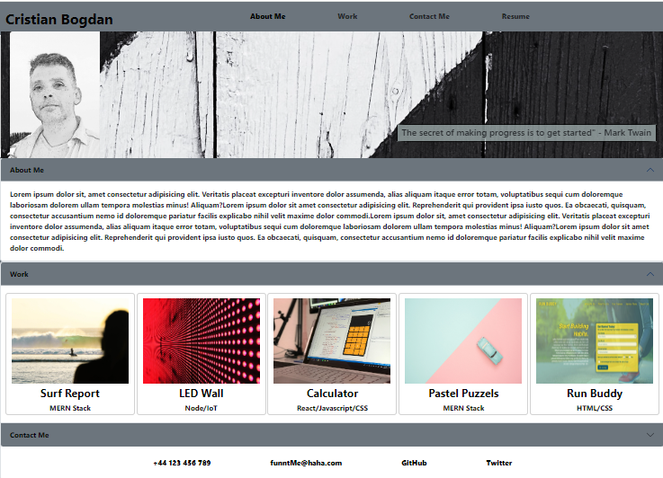

# Bootstrap-Portfolio-CristianB
Portfolio model using Bootstrap - part of Bootcamp challenge

## Description

This Project was created for bootcamp challenge.

It tests the knowledge gained in the last three weeks, especially the implementation of bootstrap blocks of codes. 

## Installation

The repository is on public domain and the deployed webpage can be access online at https://docbogdanc.github.io/Bootstrap-Portfolio-CristianB/ where it was deployed using GitHub 

## Usage

The code is free to be used according to the licence condition (please see the licence file from the GitHub repository)

## Credits

- Bootcamp ( a big cheers for bootcamp teachers! ) provided the needed **materials**, the most wanted **inspiration** and the difficult to obtain **motivation**  

  

- Bootstrap from where the following components were used :
    - Navbar : Nav
    - Card : Images and Horizontal
    - Acordion : Always open

    https://getbootstrap.com/

- Markdown Guide used for styling the readme.md

    https://www.markdownguide.org/basic-syntax/

## License

MIT license
